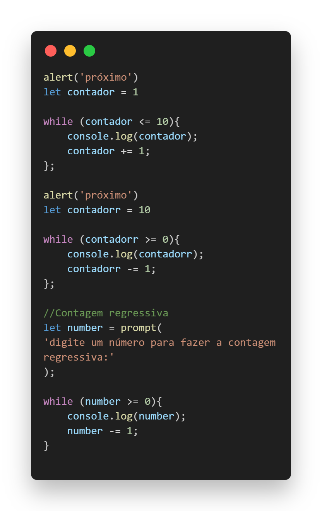
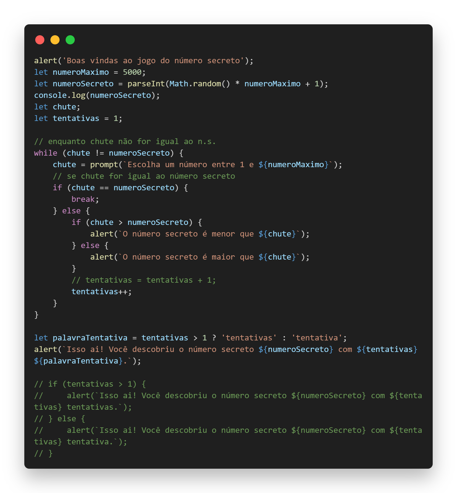
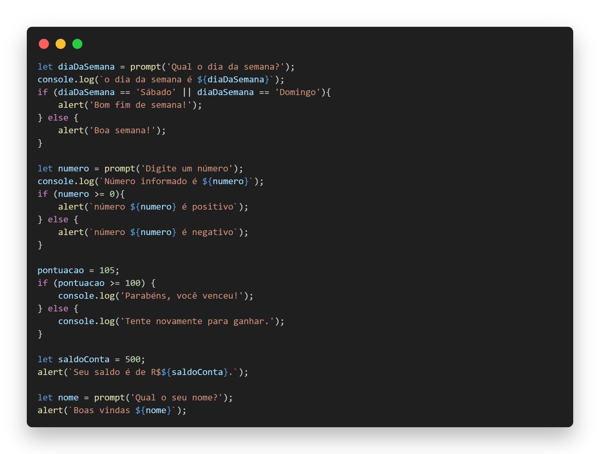

# Lógica Básica com JavaScript 🧠💻

Este projeto contém uma série de atividades introdutórias e práticas de lógica de programação utilizando JavaScript. É ideal para quem está começando a programar ou deseja reforçar conceitos fundamentais.

## 📝 Descrição do Projeto

As atividades abordam temas como:

- Estruturas de controle de fluxo (if/else, loops)
- Entrada e saída de dados com `prompt` e `alert`
- Manipulação de números e strings
- Simulação de um jogo de adivinhação 🎲

Exemplo de uma atividade: um jogo onde o usuário tenta adivinhar um número secreto gerado aleatoriamente pelo programa.

---

## 📂 Estrutura do Projeto

- **`index.html`**: Arquivo HTML básico para executar os scripts no navegador.
- **`script.js`**: Contém a lógica das atividades em JavaScript.
- **Imagens**: Pasta com imagens ilustrativas.

---

